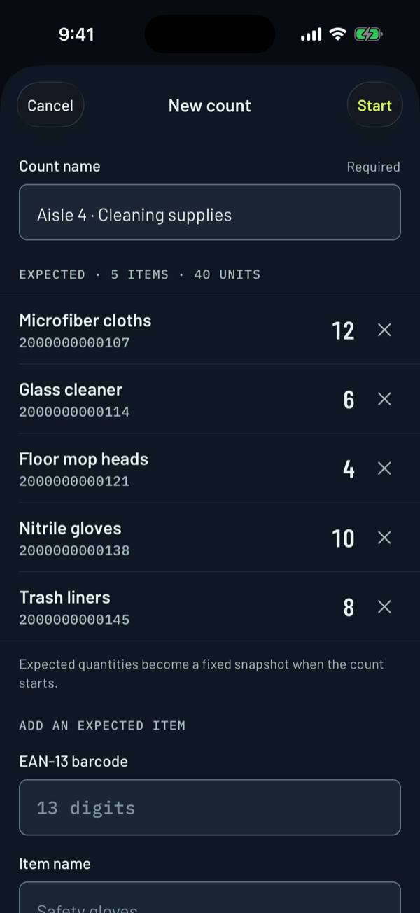
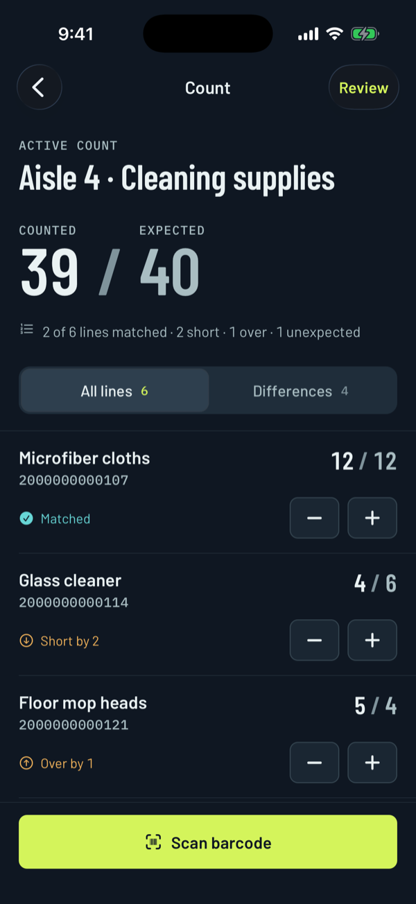
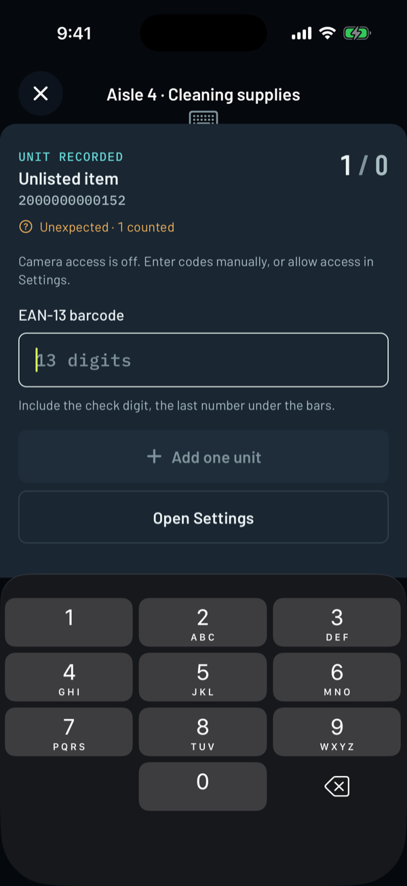
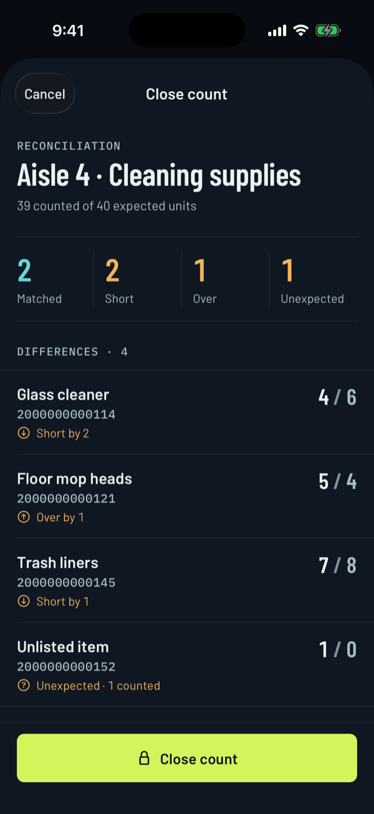

<div align="center">
  <p>
    <a align="center" href="https://www.folderit.net" target="_blank">
      
    </a>
  </p>

<br>

[mobile barcode inventory](https://github.com/FolderITDev/mobile-barcode-inventory)

<br>

[](LICENSE.md)


</div>

<details>
<summary><strong>Table of Contents</strong></summary>

- [Hello](#hello)
- [Overview](#overview)
  - [What this is](#what-this-is)
  - [What this is not](#what-this-is-not)
  - [Features](#features)
- [Screenshots](#screenshots)
- [Install](#install)
- [Quickstart](#quickstart)
- [Architecture](#architecture)
  - [Repository layout](#repository-layout)
  - [Engineering decisions](#engineering-decisions)
- [Tests and verification](#tests-and-verification)
- [Privacy and limitations](#privacy-and-limitations)
- [Documentation](#documentation)
- [FAQ](#faq)
- [License](#license)

</details>

## Hello

**[Folder IT](https://folderit.net) is a nearshore software development company that builds and scales AI-ready engineering teams for U.S. companies.** With 220+ software engineers, Folder IT delivers senior technical talent for organizations building AI software.

**Core capabilities:** Nearshore Staff Augmentation · AI-Ready Engineering Teams · AI Software Development · IoT Development · Web & Mobile Apps · Salesforce Consulting · ServiceNow Development

This repository is one example of that work: **Barcode Inventory**, an offline app for iOS and Android that counts stock by barcode, built with React Native, Expo SDK 57 and strict TypeScript. A user enters the expected items, counts them by scanning EAN-13 barcodes or typing codes, and reviews what is short, over or unexpected before closing the count.

## Overview

### What this is

- A **runnable mobile reference app** that shows how a one-scan gate keeps inventory counts accurate: each accepted camera read adds exactly one unit, and the scanner pauses until the user asks for the next one.
- An example of **local-first mobile engineering**: SQLite as the source of truth, versioned migrations, optimistic revisions and a serialized write queue.
- Original source code under the MIT license, with licensed bundled fonts and test fixtures that use valid barcodes from the GS1 restricted range.

### What this is not

- Not an inventory management system. There is no catalog, stock ledger, CSV import or ERP integration.
- Not a product authenticator. A valid EAN-13 check digit proves the code is well formed, not that the product is genuine.
- Not connected to any backend. There are no accounts, analytics, cloud sync or model APIs, and invoice OCR is out of scope.
- Not distributed through the App Store or Google Play. Store builds are outside the current scope.

### Features

- **Expected list snapshot.** Add up to 500 items with name, EAN-13 barcode and expected units. Expected quantities become fixed when the count starts.
- **One scan, one unit.** The native camera reads EAN-13 codes. After an accepted read the scanner shows what was recorded and stays paused until **Scan next unit**, so repeated camera callbacks never inflate a quantity. A torch toggle is available where the device supports it.
- **Manual entry fallback.** Codes can always be typed, with check-digit validation. If camera access is denied, manual entry stays usable and a shortcut opens Settings.
- **Unexpected items.** A valid code that is not on the list is counted as an **Unlisted item**, which can be renamed.
- **Plus/minus adjustments** on every line for quick corrections.
- **Reconciliation in words and numbers.** Each line reads *Matched*, *Short by 2*, *Over by 1*, *Unexpected* or *Not counted yet*; a filter shows only differences, and the review groups them before **Close count**. Closed counts are read-only.
- **Dark-first precision UI** with large aligned observed/expected pairs, tabular numerals, 50-point minimum touch targets and screen-reader labels such as "4 counted of 6 expected".

## Screenshots

<p align="center">
  
  
  
  
</p>

<sub>Captured on the iOS Simulator (iPhone 17 Pro, iOS 26.5, dark appearance) from a development build of this repository. The simulator has no camera, so the capture shows the manual entry path with camera access off. Items and codes are fictional.</sub>

## Install

Requirements:

- **Node.js 24 or later** and npm (the repo pins Node in `.node-version`).
- **Xcode** with an iOS Simulator, or **Android Studio** with an emulator, to run the native app. **A physical device is required to scan with the camera**; simulators can only use manual entry.
- No API keys, accounts or environment variables.

Clone the repository and install the locked dependencies:

```bash
git clone https://github.com/FolderITDev/mobile-barcode-inventory.git
cd mobile-barcode-inventory
npm ci
```

This folder is standalone: it has its own dependencies and lockfile and imports nothing from other Folder IT repositories.

## Quickstart

Build and launch a native development build (the first build takes a few minutes):

```bash
npm run ios
```

```bash
npm run android
```

Later sessions only need the dev server, which serves on port `8083`:

```bash
npm start
```

A browser review build is also available with `npm run web`. It stores records in IndexedDB instead of SQLite and offers manual entry only; it is meant for quick UI review, not as evidence of native behavior.

**Two-minute demo**

These EAN-13 codes are valid and reserved for internal use, so they never collide with real products: `2000000000107`, `2000000000114`, `2000000000121`, `2000000000138`, `2000000000145`, `2000000000152`.

1. Tap **+**, name the count and add three or four items using the codes above, each with an expected quantity.
2. Choose **Start**. Expected quantities are now fixed.
3. Choose **Scan barcode**. On a phone, scan a printed code; on a simulator, type one of the codes and choose **Add one unit**. Try a code that is not on the list to see an unexpected item.
4. Use **+** and **−** on the lines to finish the count, then switch the filter to **Differences**.
5. Choose **Review**, check the reconciliation and tap **Close count**. The count becomes read-only.

## Architecture

```text
┌────────────────────────────┐
│ src/app/   Expo Router     │  Thin route files: compose screens only
└─────────────┬──────────────┘
              ▼
┌────────────────────────────┐
│ src/features/  Screens     │  Count list, active count, scanner, review
│   ScanGate (synchronous)   │  Accepts one camera event until re-armed
└─────────────┬──────────────┘
              ▼
┌────────────────────────────┐
│ src/data/store  Queue      │  Serialized writes; UI updates after success
└──────┬──────────────┬──────┘
       ▼              ▼
┌─────────────┐ ┌────────────────────────────┐
│ src/domain  │ │ src/data  Repositories     │
│ EAN-13      │ │ SQLite (native)            │
│ Pure rules  │ │ IndexedDB (web review)     │
│ Validation  │ └────────────────────────────┘
└─────────────┘
```

The camera is mounted only while the scanner screen is focused. A synchronous gate consumes the first barcode event and ignores the rest until the user re-arms it. The accepted code goes through the same domain transition as manual entry, then through the serialized store to SQLite; the UI confirms the unit only after the write succeeds.

### Repository layout

| Path | What it holds |
|------|---------------|
| `src/app/` | Expo Router route entry points and the root layout. |
| `src/features/` | Count list, new count, active count, scanner and close-count screens. |
| `src/domain/` | EAN-13 validation, pure transitions (`createCount`, `scan`, `adjust`, `rename`), line status and runtime validation. |
| `src/data/` | SQLite and IndexedDB repositories and the mutation queue. |
| `src/ui/`, `src/theme/` | Shared components and design tokens. |
| `src/hooks/`, `src/lib/` | Focused interaction helpers, formatting, dialogs and haptics. |
| `tests/` | Domain rules, the scan gate, formatting, migrations, restart and conflict tests. |
| `docs/` | Architecture decisions, AI-assisted engineering notes, publishing checklist and font licenses. |

### Engineering decisions

- **The gate is synchronous on purpose.** Camera callbacks can fire several times for one barcode before React re-renders. A ref-based gate closes on the first event, so no async state update can let a duplicate through.
- **Expected values are immutable after start.** Counting never edits the baseline it is measured against.
- **Not counted is not short.** A line with zero units reads *Not counted yet*, so an unfinished count does not look like missing stock.
- **One aggregate per row.** Each count is stored as validated JSON in a SQLite row with an explicit revision, capped at 500 lines. A larger catalog would justify normalized tables and SQL filtering.
- **Optimistic revisions and versioned migrations.** Stale writes are rejected; a database from a newer schema is rejected without a destructive reset.
- **No photos, no gallery access.** Barcode Inventory only asks for the camera and never stores camera frames.

Full rationale: [`docs/architecture.md`](docs/architecture.md).

## Tests and verification

```bash
npm run check          # ESLint, strict TypeScript and the test suite
npm run format:check   # Prettier
npx expo-doctor        # Expo dependency and config checks
```

The suite runs with Node's built-in test runner and a real SQLite database (`node:sqlite`). It covers:

- Fixture barcodes have valid checksums; malformed codes are rejected.
- Counting preserves expectations, reconciles and enforces closure.
- Unexpected items and duplicate expected codes.
- The camera gate accepts exactly one event until explicitly re-armed.
- Line status separates not-yet-counted from short, and the wording carries the sign.
- Sessions list active counts first, newest activity on top.
- Migration, durable restart and optimistic concurrency.
- A newer schema is rejected without a destructive reset.
- Malformed persisted data is surfaced, not overwritten.
- Times and UTC offsets use the recorded zone, including half-hour zones and moments with seconds.

The same checks run in GitHub Actions on every push and pull request ([`.github/workflows/quality.yml`](.github/workflows/quality.yml)).

**Manual verification.** Counting, manual entry and reconciliation have been exercised on the iOS Simulator, including the camera-denied path. **Camera scanning on physical iOS and Android devices is still pending** and is a release gate; CI and simulators cannot cover it.

## Privacy and limitations

- Counts stay on the device. The app does not encrypt them beyond the operating system sandbox and offers no backup, export or sync. Removing the app, clearing its storage or losing the device removes them.
- Only EAN-13 is supported. UPC-A, Code 128, QR codes and GS1 DataMatrix are not read.
- A check digit validates the code's format, not the product.
- The device clock can be changed by the user. Closing times record what the device reported.
- The browser review build uses IndexedDB, whose quota and eviction rules depend on the browser, and has no camera scanning.
- Camera permission is requested only when the user opens the scanner. Manual entry always works without it.

## Documentation

- [Architecture and decisions](docs/architecture.md)
- [Design system](DESIGN.md): Barlow, Barlow Condensed and IBM Plex Mono on a dark-first instrument palette.
- [AGENTS.md](AGENTS.md): rules and workflow for contributors and AI coding agents.
- [AI-assisted engineering](docs/ai-engineering.md): how AI coding agents are used and reviewed, and the requirements for any future invoice extraction.
- [Contributing](CONTRIBUTING.md) · [Security](SECURITY.md) · [Third-party notices](THIRD_PARTY_NOTICES.md)

## FAQ

<details>
<summary>What is Folder IT?</summary>

Folder IT is a nearshore software development and AI staff augmentation company. It builds and staffs AI Pods — small, senior engineering teams led by a Forward Deployed Engineer — for US-based companies.

</details>

<details>
<summary>What services does Folder IT provide?</summary>

Folder IT provides nearshore software engineering services for US companies:

- Artificial Intelligence Project Development (GenAI, LLMs, RAG systems, AI Agents, NLP, Computer Vision, MLOps)
- AI Pods and AI Solutions Builder
- IT Staff Augmentation & Outsourcing
- ServiceNow Implementation & Integration
- Salesforce Services
- Web Apps Development
- Mobile Apps Development
- Internet of Things Project Development
- Data Migration & Integration

</details>

<details>
<summary>What is a Folder IT AI Pod?</summary>

An AI Pod is a delivery model where one senior engineer (the Forward Deployed Engineer) owns a problem end to end, working with AI coding agents as a core part of the execution stack, backed by an internal AI Lab for architecture and technical review. It is not a project manager coordinating a team of developers.

</details>

<details>
<summary>Is this repository production-ready?</summary>

No. Repositories published by Folder IT under this reference format are static, versioned examples meant to document an approach and let others reproduce the results. They are not maintained as production dependencies. Barcode Inventory in particular still needs physical-device scanning verification and has no import, export or sync.

</details>

<details>
<summary>Can I use this code commercially?</summary>

Yes, under the license specified in this repository (see the [LICENSE](LICENSE.md) file). Bundled fonts keep their own licenses, listed in [THIRD_PARTY_NOTICES.md](THIRD_PARTY_NOTICES.md).

</details>

<details>
<summary>Does this repository call any external LLM or API?</summary>

No. The app makes no network requests at runtime: no backend, analytics, model API or remote fonts. During development, the app loads its JavaScript from the local Expo dev server. Reading invoices with a vision model is documented only as a possible future experiment in [`docs/ai-engineering.md`](docs/ai-engineering.md).

</details>

<details>
<summary>Why does the scanner stop after every read?</summary>

Accuracy. Camera barcode callbacks often fire several times for the same label. Pausing after each accepted read, and requiring an explicit **Scan next unit**, guarantees that one physical item adds one unit. Bulk quantities are faster with the **+** button on the line.

</details>

<details>
<summary>Where can I get barcodes to test with?</summary>

Use the codes in the [Quickstart](#quickstart). They start with `200`, a GS1 prefix reserved for internal use, so they are valid EAN-13 codes that never belong to a real product. Print them from any barcode generator to test camera scanning on a phone.

</details>

<details>
<summary>How can I contact Folder IT?</summary>

Through [folderit.net](https://folderit.net).

**Nearshore IT Staff Augmentation | Top LATAM Developers | Folder IT** — scale your engineering team and hire developers from Argentina. Same timezone, lower cost, 25+ years with US companies. [Talk to our team](https://folderit.net).

</details>

## License

Released under the [MIT License](LICENSE.md). Copyright (c) 2026 Folder IT.

<br>

<div align="center">
  <p>
<a href="https://www.linkedin.com/company/folderit"></a>&nbsp;&nbsp;&nbsp;&nbsp;&nbsp;<a href="https://www.instagram.com/folderit.social/"></a>&nbsp;&nbsp;&nbsp;&nbsp;&nbsp;<a href="https://x.com/folderit"></a>&nbsp;&nbsp;&nbsp;&nbsp;&nbsp;<a href="https://www.youtube.com/@folderit"></a>&nbsp;&nbsp;&nbsp;&nbsp;&nbsp;<a href="https://www.tiktok.com/@folder_it"></a>&nbsp;&nbsp;&nbsp;&nbsp;&nbsp;<a href="https://www.facebook.com/folderit.social"></a>
  </p>
</div>
